# Build a SmartShop App moblie to identify and create invoices for products 

## Team Dev 
  - Thái Ngọc Quý (Leader) | Admin | 0342280638
  - Ngô Gia Bảo (Co-op)

# Diagram describing the system's operation

## Overview diagram 

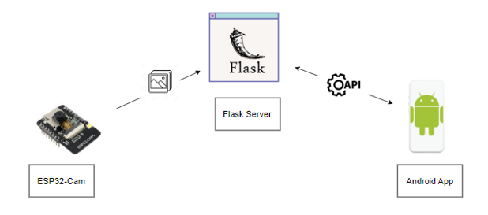

## IOT diagram 

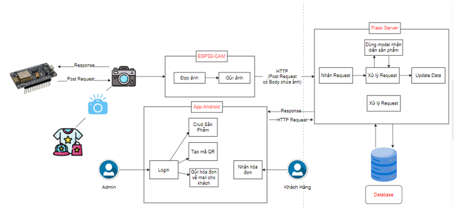

## Model Deeplearning Resnet152V2 ( Image detection ) 

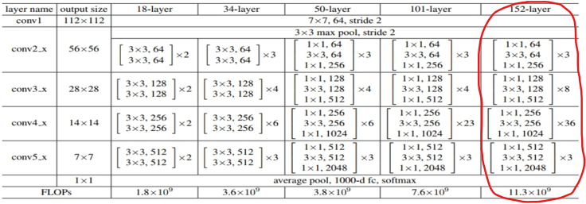

1. **Dataset**.

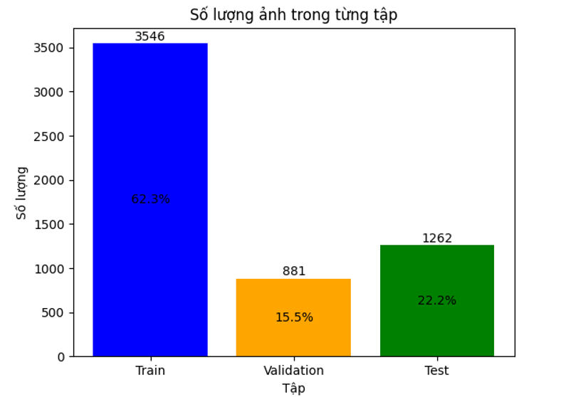

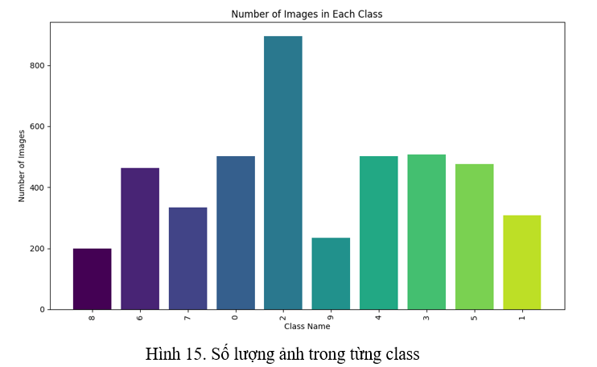
  
2. **Accuracy**.

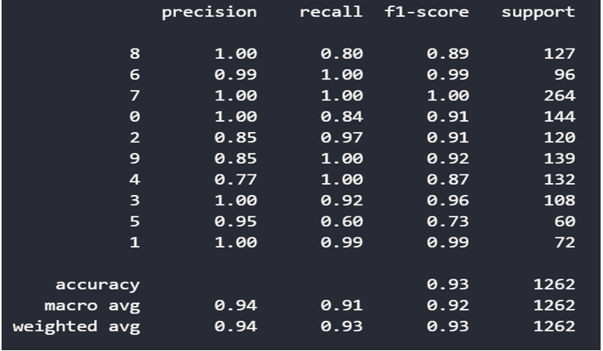

## I.  Overall this applications
- UI: Java android for mobile app.
- Back End: using Flask Framework to build Server Side API and apply model AI  - language Python.
- Database: Mongo DB.
- Model AI : Resnet152V2 ( You can find the collab notebook in the source code with the file name MODEL_RESNET152V2.ipynb )

## II.  Demo Production

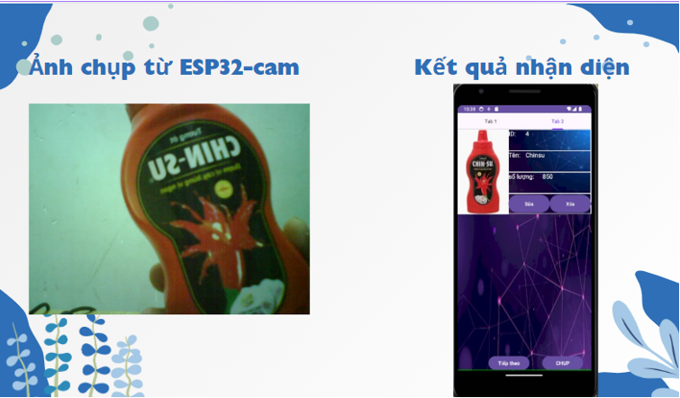

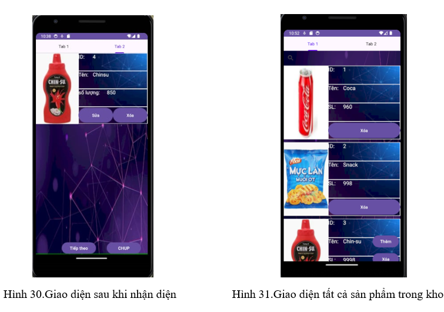

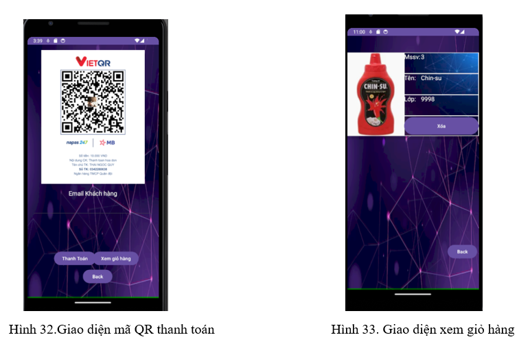

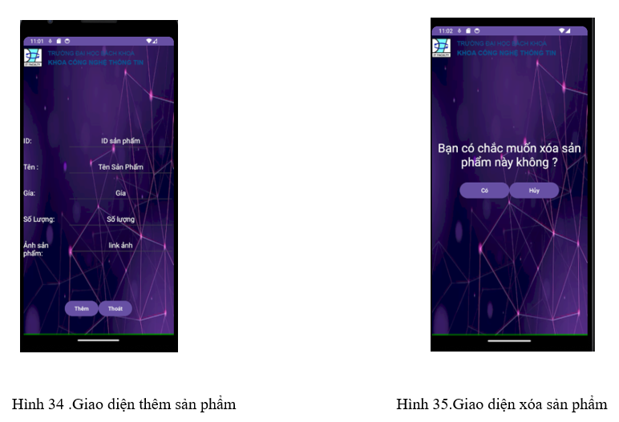

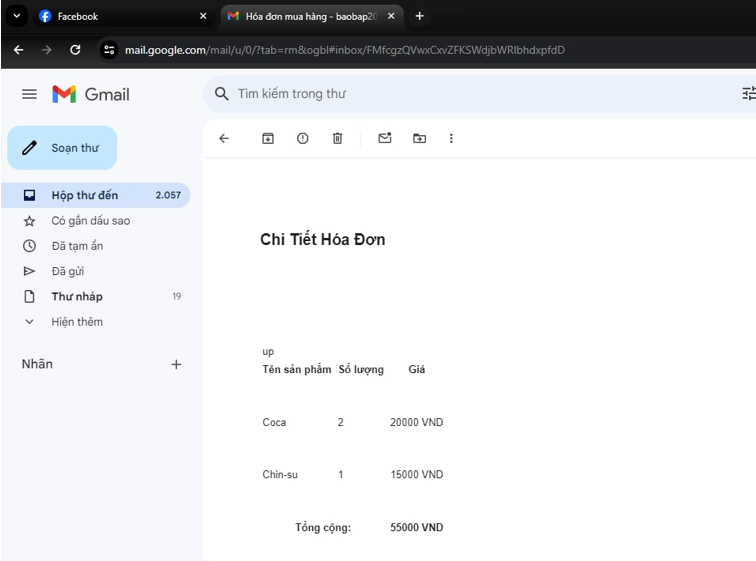
